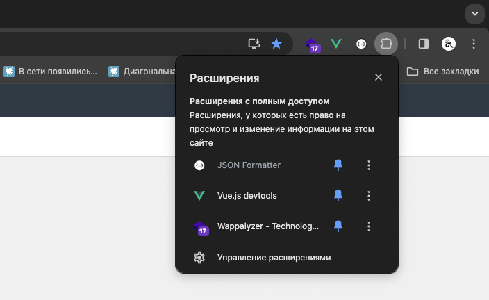
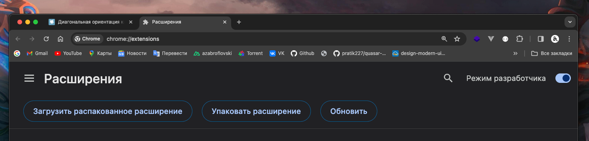

# diagonal-orientation-extension

Теперь сайты, не оптимизированные для диагональных (наклонных) экранов, будут корректно отображаться под углом.

## Установка

1. Скачайте и распакуйте расширение:
   - [Нажмите сюда](https://github.com/azabroflovski/diagonal-orientation-extension/raw/master/extension.zip) чтобы скачать архив `extension.zip`
   - Распакуйте скачанный архив. Вы получите папку `dist`

2. Установите расширение:
   - Откройте Chrome и перейдите в меню `Еще > Дополнительные инструменты > Расширения`
   - Включите режим разработчика, переключив тумблер в правом верхнем углу
   - Нажмите кнопку `Загрузить распакованное расширение`
   - Выберите папку `dist`, которую вы распаковали ранее

3. Готово! 

Расширение установлено и готово к работе.

## Why ?

Именно при наклоне в 22 ° на мониторе с разрешением сторон 21:9 получится разместить максимальную длину текстовых данных.
С диагональной ориентацией больше не придётся беспокоиться об ограничении в 80 символов на строку.

Source: https://habr.com/ru/articles/804371/

## LICENSE
MIT 

&copy; 2024 / 1 APR, DIAGONAL ORIENTATION INC.
